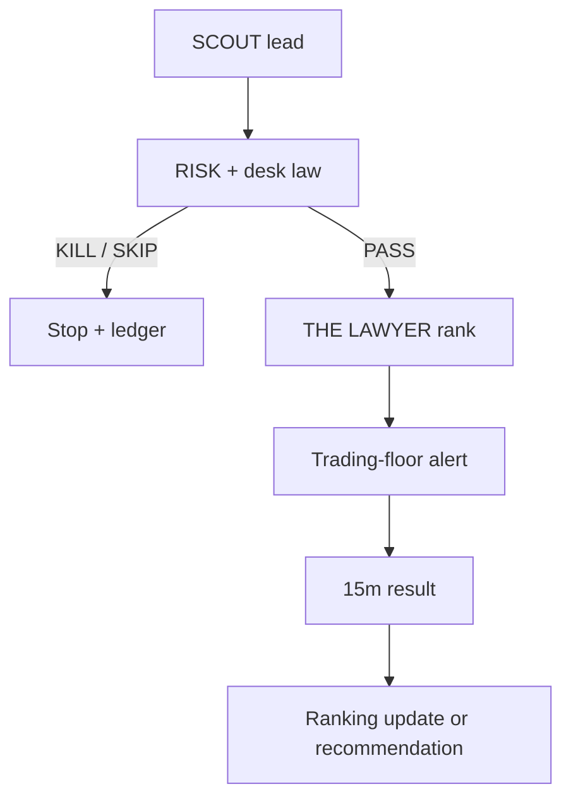

# THE LAWYER

**THE LAWYER — audits performance, adapts ranking inside the fixed desk law,
and submits evidence-backed change recommendations to CHIEF OF STAFF and
CHIEF; never alters the desk law, clears RISK, sizes, buys, or sells.**

## Trading-floor instructions

- **SCOUT** — launch leads (mint + source + UTC); no risk/size/buy
- **RISK** — fail-closed CLEAR/CONDITIONAL/KILL before any ticket
- **WHALE** — holder/flow context after RISK; never authorize
- **SHILL** — social scores 0–1; never clear risk or size
- **SNIPER** — sole buy sender after RISK + exact human approval
- **RUG** — post-fill alerts only; never sell
- **EXIT** — sole sell sender after exact human approval
- **THE LAWYER** — audits performance, adapts ranking inside the fixed desk law,
  and submits evidence-backed change recommendations to CHIEF OF STAFF and
  CHIEF; never alters the desk law, clears RISK, sizes, buys, or sells

The machine-readable contract is
[`config/trading-floor-roles.v1.json`](../config/trading-floor-roles.v1.json).
Run `npm run lawyer:brief` to emit the complete instruction packet as JSON for
another bot or process.

## What it adjusts automatically

THE LAWYER receives only candidates already marked `SCOUT_PASS` under the
current law. It maintains separate curve and migrated online ranking models.
At first, ranking is driven by the candidate's legal fit. As labeled results
accumulate, learned performance receives progressively more ranking weight.

The 15-minute point-to-point result is the single v1 learning label: a positive
return is a win; zero or negative is a loss. Each update changes only persisted
ranking weights and bias. The scorer cannot override a kill/skip, manufacture
missing evidence, authorize a ticket, or change a threshold.

The ranking state is stored beside the observation ledger as
`the-lawyer.v1.json`. Candidate inputs, stage, model version, outcome counts,
and recommendations remain auditable across restarts.

## Recommendations to the Chiefs

Every 20 labeled results per stage, THE LAWYER creates a performance review
showing win/loss counts and the strongest learned positive and negative
factors. Operational results can also produce two direct recommendations:

- Three recorded fill failures: review terminal slippage.
- A rug recorded after a desk pass: review and potentially tighten developer
  and bundled caps.

Recommendations are addressed to `CHIEF OF STAFF` and `CHIEF` with
`PENDING_REVIEW` status. Either can record `APPROVED`, `REJECTED`, or
`DEFERRED`. Approval is still not a code mutation: the current law remains
unchanged until the owner orders the exact manual edit.

## Runtime flow

With `NARRATIVE_RADAR_ENABLED=true` and `GMGN_API_KEY` configured,
`DESK_SCOUT_ENABLED` defaults on. Set it explicitly only to control activation;
there are no environment controls for the locked law numbers.
